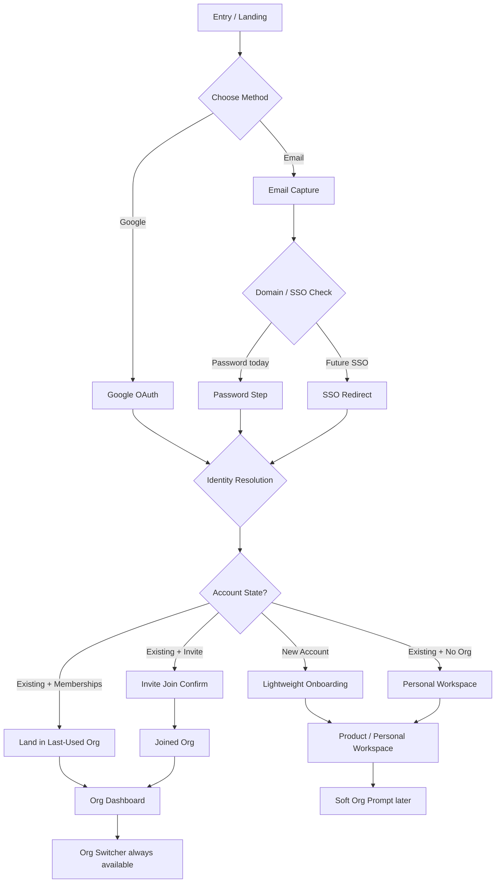
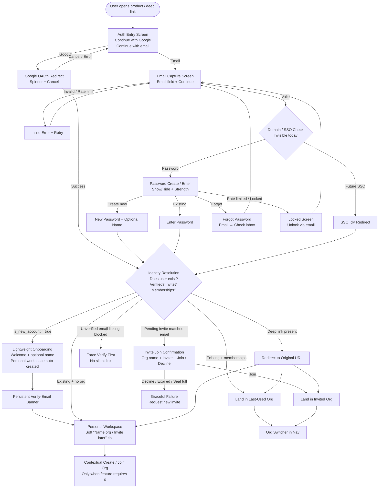
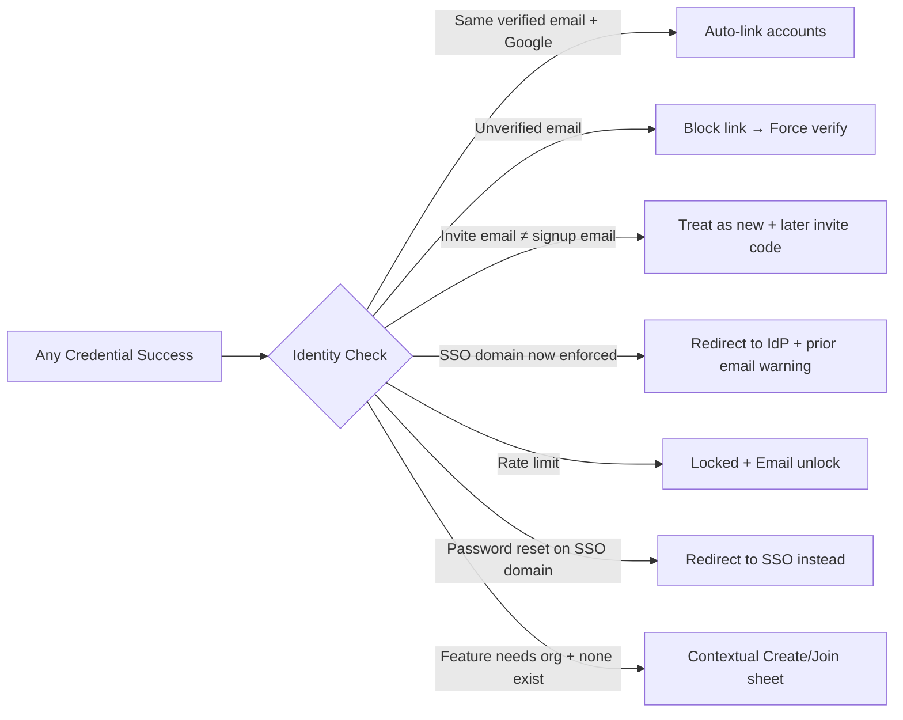

# Auth Flow — Complete UI/UX Design Specification

**Version:** 1.0  
**Status:** Production-ready  
**Scope:** Full authentication, onboarding, org handling, edge cases, accessibility, and implementation notes  
**Based on:** Deferred org creation, invited-user shortcuts, SSO-domain hook, identity/credential separation, account-state-driven onboarding

---

## Related decisions & stack alignment

This spec is the **design north-star** for the auth surface; it is implemented
**incrementally** per the phased plan in
[ADR 0016 — Authentication strategy](../decisions/0016-authentication-strategy.md)
(Better Auth: email/password → OAuth → passwordless → passkeys → MFA → org/RBAC →
SSO/SCIM). Identity, org, and session data persist via
[ADR 0019 — Data layer (PostgreSQL + Drizzle)](../decisions/0019-data-layer-postgres-drizzle.md).
The UI builds on the existing design system — Base UI + shadcn
([ADR 0007](../decisions/0007-base-ui-over-radix.md),
[ADR 0014](../decisions/0014-base-ui-adoption.md)) — and inherits the security-headers
baseline ([ADR 0015](../decisions/0015-web-security-headers.md)). The **transactional
emails** these flows send (verify, reset, security alerts) are specified separately in
[Auth Email Templates](auth-email-templates-spec.md).

**Alignment notes — reconcile during implementation:**

- **Design tokens:** the colour/type values in §4 are _indicative_. Implementation
  must map to the repo's existing shadcn **stone/neutral** tokens (`--primary`,
  `--destructive`, `--muted-foreground`, … in
  `packages/ui/src/styles/globals.css`) and the configured fonts (Geist / Inter /
  Geist Mono) — do **not** introduce a separate hardcoded indigo palette.
- **Data-model names:** the conceptual model here (`auth_identities`,
  `organizations`, `memberships`, `is_new_account`) maps onto Better Auth's
  **generated** schema — `user` / `account` (provider identities) / `session` /
  `verification`, plus the Organization plugin's `organization` / `member` /
  `invitation`. Use the generated names in code; keep this doc's terms as the model.
- **Progressive email verification** (banner, not a hard gate) is a deliberate product
  choice — Better Auth's `emailVerification` with `requireEmailVerification: false`;
  revisit if compliance mandates a hard gate.
- **Scope vs first pass:** org / invite / SSO flows here are _later_ phases (ADR 0016);
  the first implementation pass is **email/password + the identity-resolution spine**.

---

## 1. Product & User Understanding

### Core problem being solved and primary job-to-be-done

Users need to get from “I heard about this product” to “I am inside a usable workspace and can evaluate value” with the absolute minimum friction, while enterprise buyers still perceive the product as secure and mature.  
Primary job-to-be-done: “Let me prove this tool is useful for me (or my team) before I commit to naming an organization or inviting anyone.”

### Primary & secondary user personas (with goals, pain points, technical literacy, context of use)

#### Primary personas

- **Solo evaluator / B2B champion** (most common first user)  
  Goals: Sign up fast, explore core value in <5 min, later invite team or create real org.  
  Pain points: Forced org-name gates, long forms, “what is my company domain?” confusion, fear of creating the wrong org.  
  Literacy: High. Context: Often on laptop at work or personal device after hours.
- **Invited teammate**  
  Goals: Accept invite, land in the correct org/workspace with zero extra setup.  
  Pain points: Being asked to create an org or re-enter data the inviter already provided.  
  Literacy: Medium–high. Context: Mobile or desktop, often mid-task.

#### Secondary personas

- Returning power user / multi-org consultant (needs fast re-auth + org switcher).
- Security-conscious admin (expects visible session/device signals, clear SSO messaging).
- Accessibility-first user (keyboard, screen reader, reduced motion, high contrast).

### Success metrics and what “good” looks like for the user

- Time-to-first-value < 90 s for email/password and Google paths.
- Signup → product entry conversion > 70 %.
- Zero duplicate accounts from same verified email.
- Support tickets related to “wrong org / invite mismatch / locked out” < 1 % of signups.
- Accessibility: 100 % WCAG 2.2 AA on auth surfaces.  
  “Good” feels: calm, fast, trustworthy, never trapped.

### Key assumptions and risks

**Assumptions:** Most first users are individuals exploring; org commitment comes after value; Google OAuth is trusted; email verification can be progressive (banner) for conversion.  
**Risks:** Account enumeration, silent linking of unverified emails, invite-email mismatch, SSO enforcement surprise, rate-limit lockouts without clear recovery, divergent onboarding between Google and email paths.

---

## 2. Information Architecture & User Flows

### Complete sitemap / navigation structure

- Entry: `/login` (unified) or `/signup` (can redirect to same surface with mode flag)
- Email entry → domain/SSO check (invisible to user today) → password or SSO redirect
- Password / Google / future SSO credential step
- Post-auth decision: new account → lightweight onboarding | existing → last-used org or dashboard | invite present → join
- Org switcher (persistent after first membership)
- Account recovery: forgot password, unlock after rate-limit, verify-email banner
- Settings: linked identities, devices/sessions, password change (post-auth)

### Primary happy-path user flows (step-by-step)

1. **New email/password**  
   Open product → “Continue with email” → enter email → (domain check = password) → create password + name (optional) → verify-email banner appears → land in personal workspace → soft prompt later to name org / invite.
2. **New Google**  
   “Continue with Google” → Google consent → same post-auth onboarding as email (identical steps).
3. **Invited user**  
   Click invite link → if logged out, auth → email matches pending invite → skip org creation → lightweight join confirmation → land in invited org.
4. **Returning user**  
   Email or Google → last-used org (or org switcher if multiple).

### All secondary and edge-case flows

- Deep link while logged out → auth → redirect to original URL.
- Existing password user later clicks Google with same verified email → auto-link.
- Unverified email + Google attempt → block silent link, force verification first.
- Invite email ≠ signup email → treat as new account; surface “have an invite code?” later.
- Expired invite / seat limit → clear failure screen + “request new invite”.
- SSO domain later enforced → next login redirects to IdP; prior email warning sent.
- Rate-limit / lock → clear message + email unlock path.
- Password reset on SSO-only domain → redirect to SSO instead of reset form.
- Offline / poor network → optimistic UI + retry + clear offline banner.
- Multi-org → login lands on last-used; persistent org switcher in nav.
- Feature requiring org while user has none → contextual “Create or join org” sheet, not global modal.

### Decision points and branching logic

Single identity-resolution step after any credential success:  
Does user exist? → verified? → pending invite? → memberships? → is_new_account?  
All branching happens server-side; UI only reacts to the returned state.

---

## 3. Core Screens & States (Complete Inventory)

### 1. Auth Entry (Login / Signup unified)

**Purpose:** Capture identity method with minimal cognitive load.  
**Layout hierarchy:** Logo + product name (top) → primary CTAs (Google, Email) → subtle “Already have an account? Log in” toggle → legal footer.  
**States:** default, loading (after method choice), error (network), offline banner, rate-limited.  
**Content requirements:** Product name, method buttons, legal links, optional “or” divider.

### 2. Email Capture

**Purpose:** Collect email; trigger domain/SSO check.  
**Layout hierarchy:** Back → “What’s your work email?” → email field (autofocus) → Continue.  
**States:** default, validating, domain-check loading (subtle), error (invalid format / rate-limit), success → next step.  
**Data dependencies:** Email format validation + rate-limit status.

### 3. Password Create / Enter

**Purpose:** Credential step.  
**Layout hierarchy:** Email shown as read-only with “change” link → password field + show/hide → strength meter (create only) → primary button → secondary links (Forgot, Use different method).  
**States:** default, loading, validation error, server error, rate-limited / locked (with unlock CTA), success.  
**Content requirements:** Strength indicators, clear error messages, autocomplete attributes.

### 4. Google / OAuth Redirect

**Purpose:** Hand off to provider.  
**States:** redirecting spinner + “Taking you to Google…”, cancel, error return with message.

### 5. Post-Auth Decision / Onboarding (lightweight)

**Purpose:** Only for `is_new_account == true`.  
**Layout hierarchy:** Welcome + progress (1 of 2 or 1 of 3) → name (optional) → “Create personal workspace” (auto) or soft “Name your team later” → optional invite teammates later.  
**States:** default, loading, skippable, success → product.

### 6. Invite Join Confirmation

**Purpose:** Confirm join for invited users.  
**Layout hierarchy:** Org name + inviter avatar → “Join [Org]” primary → secondary decline.  
**States:** valid, expired, seat-full, already member, error.

### 7. Org Switcher / Create-Join Prompt

**Purpose:** Multi-org or first-org need.  
**Layout hierarchy:** Current org → list of memberships → “Create new” / “Join with code”.  
**States:** single, multiple, empty (prompt), loading.

### 8. Verify-Email Banner (persistent)

**Purpose:** Progressive verification.  
**States:** visible (dismissible after first), success (auto-hide), resend cooldown.

### 9. Recovery Screens

- Forgot password → email → “Check your inbox”
- Locked account → “Too many attempts” + email unlock
- SSO-enforced → “Your organization uses SSO” + redirect button

### 10. Session / Device Notice (subtle toast or settings)

New device detected → “New sign-in from [device/location]”.

All screens share: skeleton loading, offline banner, focus-visible rings, ARIA live regions for errors.

---

## 4. Visual Design System

### Design principles that guide every decision

Clarity first, speed second, quiet delight third. Reduce decisions. Trust through restraint. Never block value with setup.

### Color system (primary, secondary, semantic, neutrals) + accessibility contrast ratios

- Primary: deep indigo `#4F46E5` (AA on white 7.2:1)
- Secondary: soft slate `#64748B`
- Semantic: success `#059669`, warning `#D97706`, error `#DC2626`, info `#0284C8`
- Neutrals: pure white / near-black scale with 12 steps; surfaces use 50/100/200.
- Dark mode: inverted neutrals, primary lightened to `#818CF8` for contrast.
- High-contrast mode: pure black/white + system focus rings.

### Typography scale and hierarchy

Inter or system UI stack.  
Scale: 12 / 14 / 16 / 20 / 24 / 30 / 36.  
Hierarchy: Display (30–36) for welcome only, Title (20–24) for screen heads, Body (16), Caption (14), Micro (12).  
Line-height 1.4–1.5. Tracking tight on large sizes.

### Spacing & layout system (grid, rhythm, density rules)

8-pt base. Vertical rhythm 16/24/32/48. Form fields max-width 400 px centered. Mobile full-bleed with 16 px side padding. Density: comfortable (not compact) for auth.

### Elevation, shadows, borders, radius

0–1 for cards, 2 for modals/sheets, 3 for toasts. Soft shadow `0 1px 3px rgb(0 0 0 / 0.08)`. Radius 8 px (inputs), 12 px (cards), 16 px (modals).

### Iconography style and usage rules

Outlined, 20–24 px, 1.5 stroke. Consistent set (Lucide or equivalent). Show/hide eye, Google mark, lock, mail.

### Motion & animation principles (easing, duration, purpose of each motion)

Ease-out 200–250 ms for entrances, 150 ms for exits. Spring only for success checkmarks. Respect `prefers-reduced-motion`. No decorative motion on auth.

### Dark mode / light mode / high-contrast considerations

Full support for system preference + manual toggle. High-contrast mode available.

### Responsive behavior (mobile, tablet, desktop) and key breakpoints

Mobile-first. Breakpoints: 640 (sm), 768 (md), 1024 (lg). On mobile: full-screen sheets for recovery; desktop: centered card 420 px.

---

## 5. Interaction Design & Micro-interactions

### Detailed interaction patterns for every key action

- Email field: autofocus + select-on-focus if prefilled from invite.
- Continue: disabled until valid email; loading spinner replaces label.
- Password: live strength (create), visible toggle (always), Enter submits.
- Errors: inline under field + ARIA live polite; shake only if reduced-motion off.
- Success: brief checkmark + auto-advance (300 ms).

### Feedback mechanisms (visual, motion, haptic if relevant)

Visual + motion primary. Haptic (mobile): light impact on successful auth only.

### Progressive disclosure strategy

Password strength and “invite teammates” only after value is shown.

### Gesture support (where appropriate)

Standard platform gestures; no custom complex gestures on auth.

### Keyboard navigation and shortcuts

Full tab order, Escape closes sheets, Cmd/Ctrl+Enter submits where safe.

### Focus management and screen-reader considerations

Trap in modals, restore on close, visible rings 2 px primary. Live regions for all errors and status.

### Loading and transition choreography

Skeleton for any >300 ms wait; optimistic “Signing you in…”.

---

## 6. Edge Cases & Resilience

Explicitly cover:

- **Empty states** — “No organizations yet — create one when you’re ready.”
- **Error states** (network, validation, server, permission) — specific, actionable, never “Something went wrong.”
- **Loading & skeleton strategies** — skeletons matching final layout.
- **First-time / onboarding experience** — identical for Google & email; soft, skippable.
- **Returning user / re-engagement** — last-used org + subtle “Welcome back”.
- **Power-user / advanced features** — org switcher always one click; keyboard shortcut later.
- **Accessibility edge cases** (screen readers, motor impairment, color blindness, reduced motion) — full support.
- **Performance constraints** (slow devices, poor network) — critical CSS inlined; <100 kb JS for auth bundle.
- **Content edge cases** (very long text, missing images, zero results, massive datasets) — truncation + tooltips; initials for avatars.
- **Security / privacy moments that affect UI** — “New device” notice, session list, clear SSO messaging, rate-limit countdown.

---

## 7. Accessibility & Inclusive Design

### WCAG 2.2 AA (or higher) compliance checklist for this product

- Contrast ≥4.5:1 text, ≥3:1 UI.
- Focus visible always.
- Labels programmatically associated.
- Error identification + suggestion.
- Status messages via live regions.
- No keyboard trap.
- Target size ≥24×24 (preferably 44).
- Motion reduced.
- Language of page set.
- Autocomplete attributes correct (`email`, `current-password`, `new-password`).

### Specific inclusive design decisions made

Visible show/hide, readonly email with explanation, progressive verification banner (not hard gate), high-contrast theme support, clear language (no jargon), mobile-friendly touch targets.

### How the design supports users with different abilities and contexts

Full keyboard + screen reader support, reduced motion, high contrast, progressive disclosure, never forced multi-step setup.

---

## 8. Content & Microcopy Strategy

### Tone of voice

Calm, precise, slightly warm. “You’re in.” not “Congratulations!!!”.

### Key microcopy principles

One idea per sentence, active voice, specific next action.

### Error message philosophy

Name the problem + give the fix.  
Example: “That password doesn’t match our records. Try again or reset it.”

### Empty state copy approach

“No team yet. You can invite people anytime from Settings.”

### Confirmation and destructive action language

Short and final. “This will sign you out of all devices. Continue?”

---

## 9. Full Design Flow (Narrative Walkthrough)

Alex, a product manager evaluating tools after hours, opens the product on her laptop. She sees a clean centered card: logo, “Continue with Google”, “Continue with email”. She chooses email, types work address. The field validates instantly; Continue becomes active. She hits Enter. A brief “Checking…” (domain hook returns password). Password screen appears with her email shown read-only and a small “Change” link. She creates a password; strength meter fills quietly. She submits.

Account is new → lightweight welcome: “Welcome, Alex. We’ve set up a personal workspace so you can explore right away. You can name your organization later.” One optional field for display name. She continues and lands in the product with a soft top banner “Verify your email to unlock full access” and a dismissible “Invite teammates when ready” tip.

Two days later she invites a colleague via the in-product action. The colleague clicks the link on mobile, authenticates with Google (same email as invite), sees a single confirmation “Join Acme Design?”, joins, and lands directly in the shared org—no org-creation screen.

Later Alex’s company enables SSO. She receives an email warning. Next login she enters email, is redirected to the corporate IdP, and returns already in her last-used org. The password path is gone for that domain, communicated clearly.

If she ever hits rate-limit, she sees “Too many attempts. We’ve sent an unlock link to your email.” No silent failure. If she tries Google with an unverified email that already has a password account, she is told to verify first—no duplicate created. Deep links always restore the original destination after auth. Multi-org consultants open the product and land on the last-used workspace; the org switcher is one click away in the nav.

Every path feels intentional, never trapped, and the product remains usable the moment identity is established.

---

## 10. Implementation Notes for Engineers & Designers

### Component hierarchy suggestions

`AuthShell` → `AuthCard` → `MethodChooser` | `EmailStep` | `PasswordStep` | `OAuthRedirect` | `PostAuthRouter` → `OnboardingLite` | `InviteJoin` | `OrgPrompt`.  
Shared: `FormField`, `PasswordInput` (with toggle + strength), `InlineError`, `LiveRegion`, `Skeleton`, `Banner`.

### Critical interaction details that are easy to miss

- Single identity-resolution endpoint after any credential success.
- Email field must support `autocomplete="email"` and be readonly when locked with visible affordance.
- Password show/hide must be a real button (not CSS-only) for a11y.
- Rate-limit and email-existence checks both throttled.
- Deep-link return URL stored securely (httpOnly cookie or signed state).
- Google and email new-user paths must share the exact same onboarding component tree.
- Org creation never appears in the critical auth path.

### Animation specs that should be respected

Entrance: 220 ms ease-out opacity + 8 px translateY.  
Exit: 150 ms.  
Success check: 300 ms scale + opacity.  
Respect `prefers-reduced-motion: reduce` → instant or opacity only.

### What must never be compromised

- Accessibility (focus, labels, live regions, contrast).
- Identical onboarding for all new-account methods.
- Deferred org creation.
- Clear recovery from every error/lock state.
- No silent account linking of unverified emails.
- Redirect-after-auth for deep links.
- Rate-limit messaging with unlock path.

---

## Part 2 — Complete Screen Flow Diagrams & Visualization Specs

## Master Flow Overview (High-Level)



## Full Detailed Screen-by-Screen Flow (All States & Branches)



## Edge-Case Branch Diagram



## Complete Screen Inventory with All States

| #   | Screen Name                | Primary Purpose                        | Key States                                                 | Next Screens / Branches                           |
| --- | -------------------------- | -------------------------------------- | ---------------------------------------------------------- | ------------------------------------------------- |
| 1   | **Auth Entry**             | Method choice                          | Default, Loading, Offline, Rate-limited                    | Google Redirect / Email Capture                   |
| 2   | **Email Capture**          | Collect email + trigger domain check   | Default, Validating, Error, Rate-limited                   | Password Step / Future SSO                        |
| 3   | **Password Create/Enter**  | Credential                             | Default, Loading, Validation error, Locked, Strength meter | Identity Resolution / Forgot / Locked             |
| 4   | **Google OAuth Redirect**  | Provider hand-off                      | Redirecting, Cancel, Error return                          | Identity Resolution                               |
| 5   | **SSO Redirect** (future)  | IdP hand-off                           | Redirecting, Error                                         | Identity Resolution                               |
| 6   | **Identity Resolution**    | Single decision point (backend-driven) | Loading skeleton                                           | Onboarding / Invite Join / Last Org / Personal WS |
| 7   | **Lightweight Onboarding** | New account only                       | Default, Skippable, Loading                                | Personal Workspace + Verify Banner                |
| 8   | **Invite Join Confirm**    | Accept pending invite                  | Valid, Expired, Seat full, Already member                  | Joined Org / Failure screen                       |
| 9   | **Personal Workspace**     | First landing for new users            | Default + soft tips                                        | Soft Org Prompt / Product                         |
| 10  | **Org Dashboard**          | Existing / joined users                | Default, Multi-org                                         | Org Switcher                                      |
| 11  | **Org Switcher**           | Multi-org navigation                   | List, Empty, Loading                                       | Create Org / Join with code                       |
| 12  | **Contextual Org Prompt**  | Feature requires org                   | Sheet / modal (non-blocking)                               | Create / Join                                     |
| 13  | **Verify-Email Banner**    | Progressive verification               | Visible, Dismissed, Resend cooldown, Success               | Stays until verified                              |
| 14  | **Forgot Password**        | Recovery                               | Email sent, Error, SSO-domain redirect                     | Check inbox / back to Entry                       |
| 15  | **Locked Account**         | Rate-limit recovery                    | Locked + unlock CTA                                        | Email unlock path                                 |
| 16  | **Invite Failure**         | Expired / seat limit                   | Clear message + request new invite                         | Back or support                                   |
| 17  | **New Device Notice**      | Security signal                        | Toast / settings entry                                     | Dismiss                                           |

## Happy Path Visual Sequences (Linear)

### New Email/Password User

```text
Entry → Email Capture → Password Create → Identity Resolution (new)
→ Lightweight Onboarding → Personal Workspace + Verify Banner
→ (later) Soft Org Prompt
```

### New Google User (identical onboarding)

```text
Entry → Google OAuth → Identity Resolution (new)
→ Lightweight Onboarding → Personal Workspace + Verify Banner
```

### Invited User

```text
Invite Link → Entry (or auto) → Auth → Identity Resolution (invite match)
→ Invite Join Confirm → Joined Org
```

### Returning Multi-Org User

```text
Entry → Auth → Identity Resolution → Last-Used Org + Org Switcher available
```

### Deep Link While Logged Out

```text
Deep Link → Entry → Auth → Identity Resolution → Original URL restored
```

---

## Additional Deep Implementation Specs

### Recommended Route Structure

- `/auth` or `/login` — unified entry
- `/auth/email` — email capture
- `/auth/password` — password step
- `/auth/callback/google` — OAuth return
- `/auth/onboarding` — lightweight (new accounts only)
- `/auth/invite/:token` — invite join
- `/auth/recover` — forgot / locked
- Post-auth redirects handled by single `PostAuthRouter` component

### Data Model Alignment (from original principles)

- `auth_identities` table (one user → many providers)
- `organizations` + `memberships` separate
- `is_new_account` flag drives onboarding
- Domain → `auth_mode` lookup (currently always `password`)

### Critical Non-Negotiables for Engineering

1. One identity-resolution call after any successful credential.
2. Google and email new-user paths must render the exact same onboarding tree.
3. Org creation is never a gate before product access.
4. Deep-link return URL must survive the full auth journey.
5. Rate limiting applies to both password attempts and email existence checks.
6. All error messages must be announced to screen readers via live regions.
7. Password show/hide is a real accessible button.
8. Readonly email fields still show a visible “why can’t I edit this?” affordance.

### Suggested Component Library Mapping

- `AuthShell` (layout + theme)
- `AuthCard` (centered 420px max)
- `MethodButton` (Google / Email)
- `EmailField` + `PasswordField` (with strength + toggle)
- `InlineError` + `LiveRegion`
- `SkeletonAuth`
- `VerifyEmailBanner`
- `OrgSwitcher`
- `InviteConfirmCard`
- `SoftPromptToast` / `ContextualSheet`

---

## 11. Critical Design Decision — Auth Entry Pattern

### Decision

We use a **two-step method-first approach**:

```
Screen 1: Choose method
   • Continue with Google
   • Continue with email   → goes to Screen 2

Screen 2: Enter email → Continue → Password
```

We deliberately do **not** put the email field directly on the first screen.

### Alternative Considered

```
Screen 1:
   • Continue with Google
   • Email field + Continue button (directly on first screen)
```

### Full Evaluation

| Criteria                        | Current (Method first)                   | Alternative (Email field on first screen)          | Winner  |
| ------------------------------- | ---------------------------------------- | -------------------------------------------------- | ------- |
| **Speed for email users**       | Slightly slower (extra click)            | Faster (one less screen)                           | Alt     |
| **Clarity of choice**           | Very clear: two equal primary actions    | Email feels more prominent than Google             | Current |
| **Visual hierarchy**            | Clean, balanced                          | Email field competes with Google button            | Current |
| **Mobile experience**           | Excellent (big tappable buttons)         | Keyboard pops up immediately (can feel aggressive) | Current |
| **Google / SSO users**          | Clean path, no distraction               | Extra visual noise                                 | Current |
| **Error / rate-limit handling** | Easy to isolate                          | Harder (field is always present)                   | Current |
| **Future SSO**                  | Domain check stays invisible             | Same                                               | Tie     |
| **Cognitive load**              | One decision at a time                   | Two things at once (method + typing)               | Current |
| **Conversion (industry data)**  | Slightly higher for dual-method products | Better only when email is the dominant method      | Depends |

### Why the current design is the right choice for this product

1. **Two strong first-class methods** (Google + Email).  
   When Google is a primary option, putting the email field on the same screen makes Google feel secondary. Most modern B2B products (Linear, Notion, Figma, Stripe, Vercel, etc.) keep method choice first for this reason.

2. **Lower psychological commitment**.  
   “Continue with email” is a soft commitment. Users who are unsure can still back out easily. Putting the field immediately can feel slightly more pushy.

3. **Better progressive disclosure**.  
   We only ask for the email after the user has already chosen the email path. This keeps the first screen extremely clean and fast to scan.

4. **Superior mobile behavior**.  
   On mobile, showing the email field on load forces the keyboard open immediately for many users who actually wanted Google. This is a common complaint.

5. **Future-proofing for SSO**.  
   When SSO arrives, the flow stays clean. Domain check happens after email is submitted, not on a crowded first screen.

### When the alternative would be better

The “email field on first screen” pattern works well when:

- Email/password is clearly the dominant method (e.g. older enterprise tools or internal tools with very low Google usage).
- Maximum speed for returning email users is the top priority.
- Almost no other social/SSO options exist.

### Hybrid option (documented for future consideration)

Some products expand the email field _in place_ after clicking “Continue with email” (no full page navigation). This keeps the first screen clean while removing a full screen transition. We can A/B test this later if needed.

### Final Recommendation

**Stick with the current two-step (method-first) approach.**

- The extra click costs ~1–1.5 seconds but gains clarity, better mobile behavior, and cleaner hierarchy.
- If future analytics show >70–75% of users choose email _and_ Google usage is low, revisit and A/B test moving the email field to the first screen.

**Status:** Decision locked for v1. Documented for transparency and future review.

---

## End of Specification

This document is self-contained and ready for design hand-off, engineering implementation, and stakeholder review. All original principles, flows, edge cases, accessibility requirements, and visualization diagrams are included.
